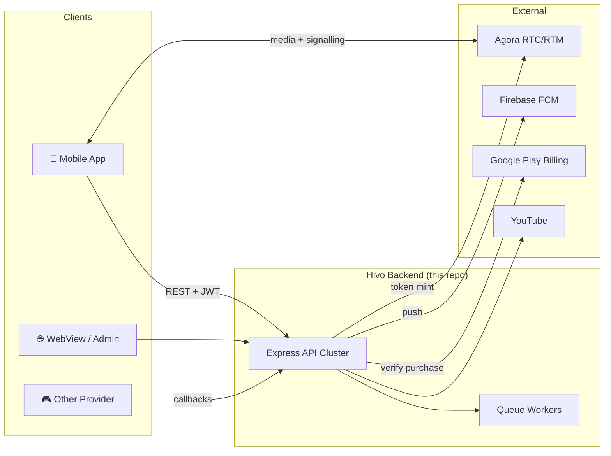
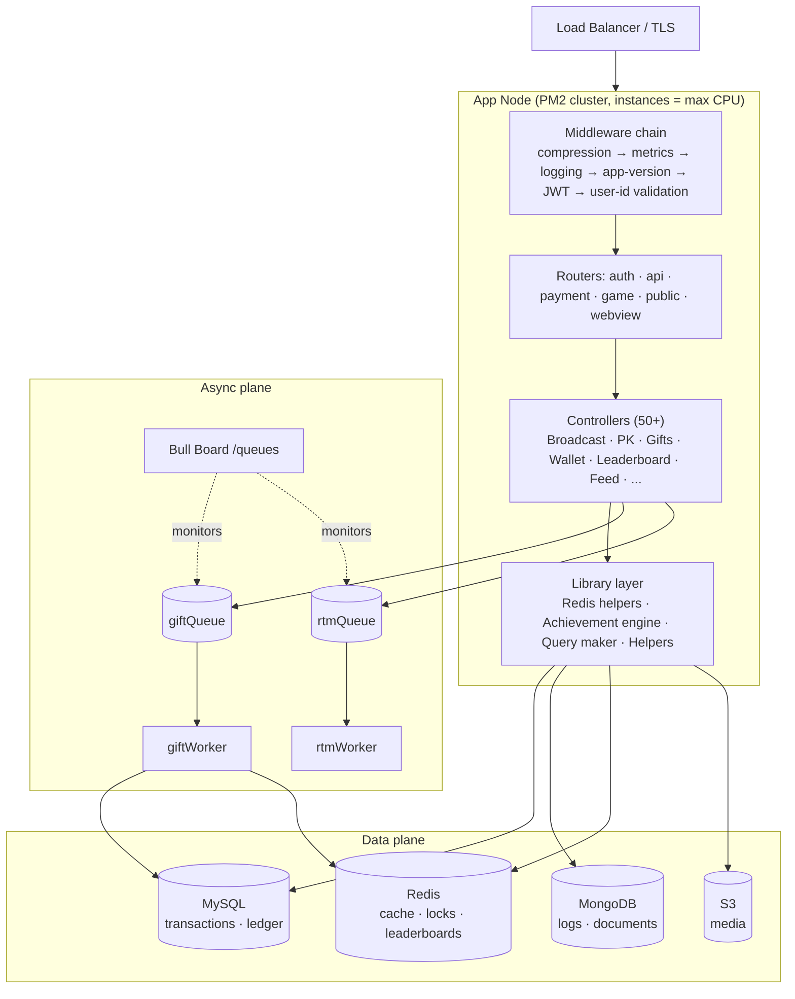
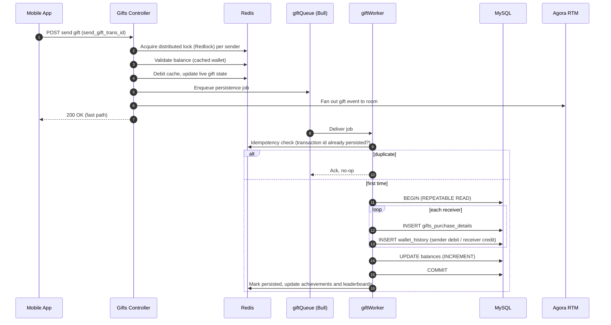
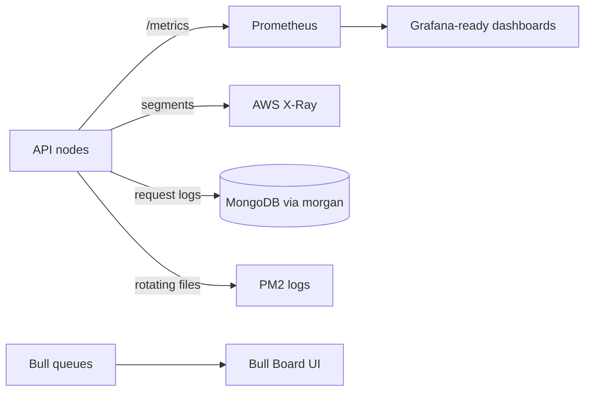

<div align="center">

# 🎥 Real-Time Live Streaming & Social Commerce Platform

### Backend architecture, design decisions and engineering deep-dive


</div>

---

## 📑 Table of Contents

1. [Executive Summary](#-executive-summary)
2. [My Role](#-my-role)
3. [System Context](#-system-context)
4. [Capability Map](#-capability-map)
5. [Logical Architecture](#-logical-architecture)
6. [Deep Dive: Virtual Gifting Pipeline](#-deep-dive-virtual-gifting-pipeline)
7. [Data Architecture](#-data-architecture)
8. [Non-Functional Requirements](#-non-functional-requirements)
9. [Scalability & Resilience](#-scalability--resilience)
10. [Security](#-security)
11. [Observability](#-observability)
12. [Deployment & Operations](#-deployment--operations)
13. [Architecture Decision Records](#-architecture-decision-records)
14. [Trade-offs & Future Roadmap](#-trade-offs--future-roadmap)
15. [Tech Stack](#-tech-stack)
16. [Repository Structure](#-repository-structure)
17. [Run Locally](#-run-locally)

---

## 🧭 Executive Summary

Hosts broadcast live, viewers join and chat, and they support hosts with **virtual gifts** that have real monetary value. The platform has to handle:

- **High-fan-out real-time interaction:** live rooms, chat, PK battles and gift animations.
- **A financial-grade virtual economy:** wallets, purchases, gifts and payouts where a double-spend or lost transaction is a business incident.
- **Read-heavy engagement features:** leaderboards, feeds and explore, which are expensive to compute.
- **Operational complexity:** multi-environment deployments, third-party integrations and data reconciliation.

The system is a **modular monolith** with **asynchronous workers**, using **polyglot persistence**. It scales horizontally by running on all CPU cores per node and across nodes behind a load balancer.

| | |
|---|---|
| **Domain** | Live streaming · social · virtual economy |
| **Style** | Modular monolith + async workers, event-driven where it matters |
| **Surface** | 50+ controllers, 5 route groups (`/auth`, `/api`, `/payment`, `/game`, `/public`, `/webview`) |
| **Data** | MySQL (ledger), MongoDB (documents/logs), Redis (cache, locks, leaderboards) |
| **Real-time** | Agora RTC/RTM, Socket.IO |
| **Cloud** | AWS (SQS, S3, X-Ray, CodeDeploy), Firebase |

---

## 👤 My Role

Backend / solutions architecture across the platform:

- Designing service boundaries, data models and API contracts.
- Designing the transaction, caching and queueing strategy for the virtual economy.
- Defining the observability, deployment and reconciliation tooling.
- Integrating third-party systems (Agora, Firebase, Google Play).

---

## 🌐 System Context



---

## 🗺️ Capability Map

| Domain | Capabilities |
|---|---|
| **🎬 Live** | Public and private rooms, broadcast lifecycle, member roles, live home and feed, Agora token issuance |
| **⚔️ PK** | Real-time streamer-vs-streamer battles, scoring, PK leaderboards |
| **💎 Economy** | Gifts (including lucky gifts with configurable return/reserve ratios), backpack, store, wallet, transaction history, Google Play purchases, agents |
| **👥 Social** | Friends, groups, couples (CP), notifications, help center, ratings |
| **🏆 Engagement** | Leaderboards (daily/monthly/lifetime), levels, VIP/SVIP, achievements, daily check-ins, explore, banners and ads |
| **🛠️ Platform** | Auth and refresh tokens, app-version gating, config service, uploads and image processing, logging, cache control |

---

## 🏛️ Logical Architecture



**Key principles**
- **Thin controllers, shared library layer:** cross-cutting logic (achievements, Redis access, SQL building) lives in `library/` and `models/`.
- **Cheap work stays synchronous, expensive work goes async:** gift persistence, achievement updates and RTM fan-out are queued.
- **Cache as a first-class read path:** leaderboards and live data are served from Redis. MySQL is the system of record.

---

## 💸 Deep Dive: Virtual Gifting Pipeline

Gifting is the highest-stakes flow. It moves real value, runs at high concurrency during live events, and must be **idempotent, atomic and auditable**.



**Design guarantees**

| Concern | Mechanism |
|---|---|
| **Double-spend** | Redlock distributed lock around balance mutation |
| **Duplicate delivery** (retries, at-least-once queues) | Idempotency key (`send_gift_trans_id`) checked in Redis before the DB write |
| **Atomicity** | A single MySQL transaction under `REPEATABLE READ` covers the multi-receiver purchase, ledger rows and balance updates |
| **Auditability** | Immutable `wallet_history` rows with typed entries (`gift_sent`, `gift_received`, ...) |
| **Lucky-gift economics** | Config-driven host / reserve / disburse ratios, with cashback recorded per transaction |
| **Latency** | The user gets a response from the fast path. The durable write happens off the request thread |
| **Self-healing** | Reconciliation scripts (below) detect and repair cache-vs-DB drift |

---

## 🗄️ Data Architecture

**Polyglot persistence: each store does what it is best at.**

| Store | Used for | Why |
|---|---|---|
| **MySQL** | Wallet, gift purchases, ledger, users, relational config | ACID transactions, referential integrity, auditable money movement |
| **MongoDB** | Request/transaction logs, flexible documents | Schema flexibility and high write throughput for append-heavy data |
| **Redis** | Hot reads, leaderboards (sorted sets), wallet and live-state cache, distributed locks, idempotency keys, queue backing | Sub-millisecond reads and atomic primitives |
| **S3** | Images and gift assets | Cheap, durable object storage; Sharp for on-the-fly processing |

**Consistency model:** MySQL is the source of truth. Redis is the performance layer, kept consistent by the worker write path. Because caches can drift, the repo ships **operational reconciliation tooling** in `scripts/`:

- `walletMissmatchCheck`, `walletSyncFromCache`: wallet integrity
- `mydataMissmatchCheck*`, `mydataMissmatchFixFromCache`: per-user data repair
- `leaderboardSync`, `pkLeaderboardSync`: leaderboard rebuilds
- `giftDataSync`, `contributorListSync`: gift and contributor data backfills
- `SyncLifetimeMismatch`: lifetime-stat reconciliation

---

## 📐 Non-Functional Requirements

| Attribute | Approach |
|---|---|
| **Performance** | Redis-first reads, gzip compression, keep-alive tuning (`keepAliveTimeout` 65s, `headersTimeout` 66s to avoid LB 502s), async heavy work |
| **Scalability** | Stateless API nodes, PM2 cluster mode on all cores, horizontal scale-out behind a load balancer, queue-based load levelling |
| **Availability** | PM2 auto-restart with exponential backoff, `max_memory_restart`, a health endpoint used by the deployment pipeline |
| **Consistency** | ACID ledger in MySQL, idempotent consumers, distributed locks |
| **Security** | JWT + refresh tokens, app-version gating, validated inputs, secrets via config |
| **Observability** | Prometheus metrics, X-Ray tracing, structured request logs, Bull dashboard |
| **Maintainability** | Modular controllers, per-environment config, Swagger docs, Mocha/Chai tests |

---

## 📈 Scalability & Resilience

- **Vertical:** `instances: 'max'` runs one worker per CPU core.
- **Horizontal:** Nodes are stateless. Session state is in JWT and Redis, so adding nodes needs no coordination.
- **Load levelling:** Bull and SQS absorb gift and RTM bursts (such as a big PK moment) without overloading MySQL.
- **Backpressure and retries:** Queue workers retry failed jobs. Idempotency makes retries safe.
- **Crash containment:** `max_restarts`, `min_uptime` and `exp_backoff_restart_delay` stop crash loops from taking down a node.
- **Graceful degradation:** Cache-backed reads keep the app usable if non-critical downstream calls are slow.

---

## 🔐 Security

- **AuthN/Z:** Bearer JWT verified on every `/api` and `/payment` request, with refresh-token support and per-request user-id validation middleware.
- **Version gating:** `checkAppVersion` middleware can force outdated clients to upgrade.
- **Input validation:** Joi and express-validator.
- **Passwords:** bcrypt hashing.
- **Transport:** TLS termination, with certificate support in-repo for test environments.
- **Payments:** Server-side verification of Google Play purchases. Clients are never trusted for entitlement.
- **Least exposure:** Admin and queue dashboards are separate routes. Public, webview and game routes are isolated from the authenticated API.

---

## 🔭 Observability



- **Metrics:** `express-prom-bundle` exposes per-route, per-method latency and throughput.
- **Tracing:** AWS X-Ray for distributed traces.
- **Logging:** HTTP request logs persisted to MongoDB (`mongoose-morgan`) and file logs rotated with `rotating-file-stream`.
- **Queues:** Bull Board at `/queues` shows job states, retries and failures.

---

## 🚢 Deployment & Operations

- **Packaging:** `ecosystem.config.js` (PM2 cluster).
- **CI/CD:** AWS CodeDeploy (`appspec.yml`) gated by the `/` health response. The pipeline fails the deploy if the app doesn't return 200.
- **Environments:** `config/` per-environment overrides selected by `NODE_ENV` (dev, stage, prod, test).
- **Runbooks as code:** 38 operational scripts for syncs, audits, cleanups and one-off migrations.
- **Time handling:** Timezone normalisation (`fixTimeZone`) and config-driven UTC offsets for consistent leaderboards and daily and monthly resets.

---

## 🧾 Architecture Decision Records

| # | Decision | Rationale | Trade-off |
|---|---|---|---|
| 1 | **Modular monolith, not microservices** | Small team, one deployable, shared domain model, lower operational cost | Needs discipline to keep modules decoupled; can be split later along the queue boundaries |
| 2 | **MySQL for money, Redis for speed** | Ledger needs ACID. Reads need microseconds | Dual-write consistency, mitigated with idempotent workers and reconciliation jobs |
| 3 | **Async persistence for gifts** | Keeps p99 low during bursts and decouples UX from DB write latency | Eventual consistency window, covered by cache-as-truth-for-now and a durable queue |
| 4 | **Idempotency keys over exactly-once** | Exactly-once is impractical. At-least-once plus idempotency is robust | Requires a unique transaction id from the client or API |
| 5 | **Redlock for balance mutation** | Prevents concurrent double-spend across nodes | Lock contention for very hot senders, and lock-TTL tuning |
| 6 | **Mongo for logs** | High-volume append writes, flexible schema | Extra datastore to operate |
| 7 | **Agora for media, Socket.IO and RTM for signalling** | Offloads the hardest real-time problem (media) to a specialist | Vendor dependency and cost scaling with usage |
| 8 | **PM2 cluster over container orchestration** | Simple, proven and fast to operate for the current scale | Less elastic than Kubernetes autoscaling |

---

## 🔮 Trade-offs & Future Roadmap

If this platform were to scale another order of magnitude, the next architectural steps would be:

- **Extract bounded contexts** (Wallet/Ledger, Live/PK, Leaderboard) into services along the existing queue seams.
- **Event backbone:** move from per-feature queues to a durable event log (Kafka or SNS+SQS fan-out) so achievements, leaderboards and notifications become independent subscribers.
- **Outbox pattern** on the ledger transaction to remove the remaining dual-write risk between MySQL and Redis.
- **Read replicas and sharding** by `user_id` for the wallet and history tables.
- **Containerise and autoscale:** Docker with ECS/EKS and HPA driven by queue depth and CPU.
- **Infrastructure as Code:** Terraform for networking, data stores and queues.
- **Contract-first APIs:** an OpenAPI source of truth with generated clients and contract tests.
- **SLOs and alerting:** error-budget dashboards on top of the existing Prometheus metrics.

---

## 🧰 Tech Stack

| Layer | Technology |
|---|---|
| **Runtime / Framework** | Node.js, Express, EJS (webviews) |
| **Real-time** | Socket.IO, Agora RTC & RTM |
| **Databases** | MySQL (mysql2), MongoDB (Mongoose), Redis (ioredis) |
| **Async** | Bull, AWS SQS (sqs-consumer), node-cron |
| **Concurrency control** | Redlock, redis-lock |
| **Cloud / Platform** | AWS (S3, SQS, X-Ray, CodeDeploy), Firebase Admin / FCM, Google APIs |
| **Media** | Sharp, Multer |
| **Security** | jsonwebtoken, bcrypt, Joi, express-validator, CORS |
| **Observability** | prom-client / express-prom-bundle, AWS X-Ray, Morgan + rotating-file-stream, Bull Board |
| **Quality / Docs** | Mocha, Chai, chai-http, Swagger |
| **Process mgmt** | PM2 (cluster mode), Nodemon (dev) |

---

## 📁 Repository Structure

```
├── index.js                 # App bootstrap: middleware chain, routers, Bull Board
├── cluster.js               # Cluster bootstrap
├── ecosystem.config.js      # PM2 production config
├── appspec.yml              # AWS CodeDeploy spec
├── controllers/             # 50+ domain controllers (Broadcast, PK, Gifts, Wallet, ...)
├── routes/                  # auth · web(api)
├── middleware/              # app-version gate, validation, logger
├── models/                  # Query maker, MySQL/Mongo models
├── library/                 # Redis helpers, engine, utilities
├── queue/                   # giftQueue/Worker, rtmWorker
├── payment/                 # Purchase handling
├── config/                  # Per-env confi
├── scripts/                 # ops scripts: syncs, audits, migrations
├── api_docs/                # Swagger docs
└── views/ · themes/ · static/ · images/
```

---

## ▶️ Run Locally

```bash
npm install
export NODE_ENV=development
npm run dev        # nodemon
npm test           # mocha + chai
```

> 🔒 **Note:** The source code is private. This document is a portfolio-level architecture overview. Configuration values, credentials and business data are intentionally excluded.

---

<div align="center">

**Biswajit Chowdhury**: Backend Engineer & Solutions Architect
🌐 [biswaj.it](https://biswaj.it)

</div>
